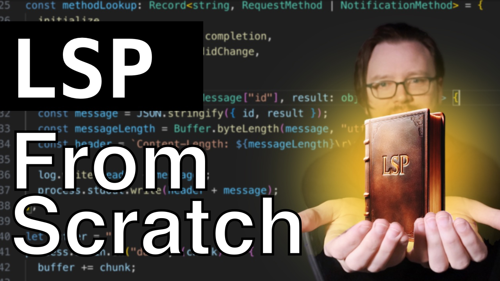
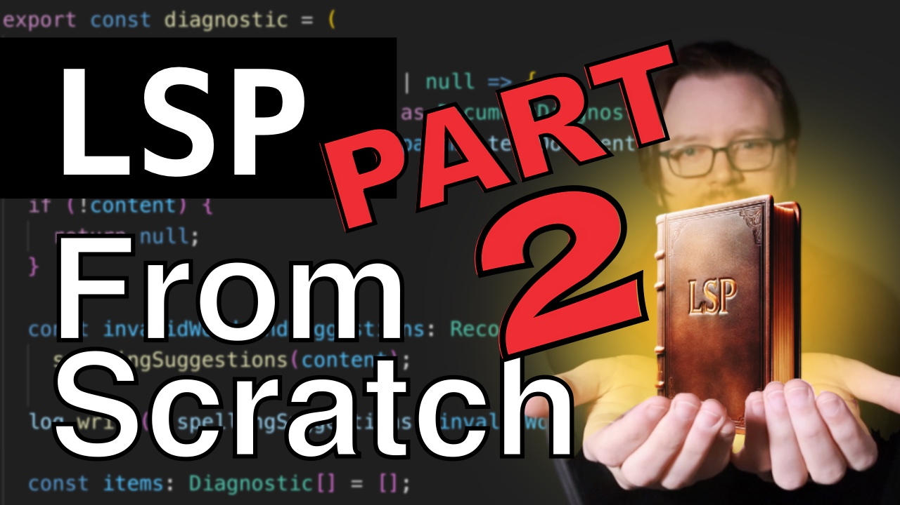
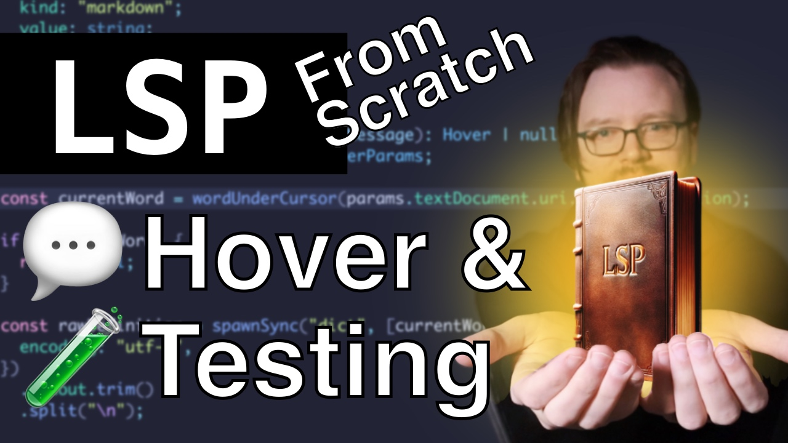

A simple language server to walk-through learning the LSP

Based on https://github.com/semanticart/minimum-viable-vscode-language-server-extension

[Watch the YouTube video where the first version of this code was written ](https://youtu.be/Xo5VXTRoL6Q)

[Part 2 ](https://www.youtube.com/watch?v=t1nI8i-D4oM)

[Part 3 ](https://www.youtube.com/watch?v=yF2XDhjUt8U)
